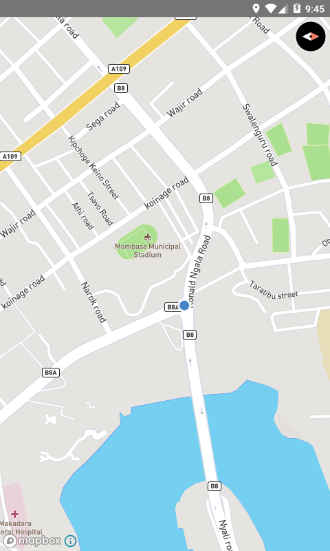

# :books: mapview-mapbox

A mapview example for Android using Mapbox.

## :hammer: Build Setup

```bash
# clone mapview-mapbox project
git clone git@github.com:philwamba/mapview-mapbox.git

# open mapview-mapbox directory
cd mapview-mapbox

# install dependencies
yarn install

# run project on android
react-native run-android
```

## :paperclip: Screenshot


